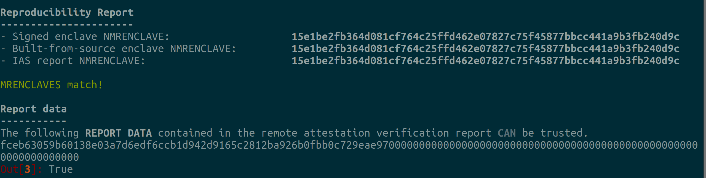
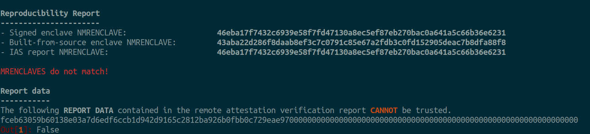

Examples
========
This section presents examples which can be followed through to see how the
``auditee`` tool can be used. Each example contains the source code of an
enclave application, which for the sake of demonstration could be seen as
being under audit. One could imagine that an auditing party would inspect the
source code of the enclave to verify that it meets a set of requirements with
respect to security, functionalities, etc. In addition to the source code,
each example contains a pre-built and signed enclave binary, usually named
``Enclave.signed.so``, and a remote attestation verification report from
Intel's attestation service (IAS). In these examples, the IAS report is in a
json file, usually named ``ias-report.json``, which also contains Intel's
signature and certificate necessary to verify the authenticity of the report.
To sum up, an example contains the following pieces of information:

* enclave source code
* pre-built signed enclave binary (``Enclave.signed.so``)
* remote attestation report verified by Intel (``ias-report.json``)

A remote attestation report can contain application and/or user specific data
in a field named ``REPORT_DATA``. This report data is added by the enclave
code at the time a quote is generated. Each example presented in this
documentation will attempt to show a different usage of this ``REPORT_DATA``
field.

.. One important thing to notice is that if a remote attestation report
.. is "trusted" and hence the ``REPORT_DATA`` it contains, users and applications
.. can rely this ``REPORT_DATA``.

.. For background information see the section `<background-examples>`.

Prerequisites
-------------
To follow through the examples as they are presented it's best that you have
recent versions of `docker`_ and `<docker-compose>`_.

Clone the repository:

.. code-block:: shell

    $ git clone --recurse-submodules https://github.com/sbellem/auditee.git

.. _sgx-hashmachine:

SGX Hash Machine
----------------
Let's imagine Alice claims that the hexadecimal string

.. code-block:: python

    fceb63059b60138e03a7d6edf6ccb1d942d9165c2812ba926b0fbb0c729eae97

is the result of having computed the SHA 256 hash 100 million times, starting
with the string ``"Hello World!"``, and repeatedly hashing the new result of
each iteration. For instance, in Python:

.. code-block:: python

    from hashlib import sha256
    from time import time

    s = b'Hello World!'
    begin = time()
    for _ in range(1000000000):
        s = sha256(s).digest()
    end = time()
    print(f'time to compute: {end - begin})'
    print(f'computed value: {s}')

You could perform the computation yourself, using the above code snippet, to
verify the claim. This may take a minute or so. But if the number
of iterations was larger, say one trillion, it could take a couple of days ...
What if the computation took a month, a year? So let's say that for whatever
reason you do not want or cannot perform the computation yourself.

Could you be convinced in another way that the claim is true?

The goal of this example is to show that, if you trust Intel, then you could
indeed be convinced that the claim is true. That is, presented with a remote
attestation verification report, which contains the result of the computation,
we'll verify whether this report "matches" source code that does perform
the 100 million-times hashing computation over "Hello World!".

To convince yourself that the claim is true, we'll go through the following
steps:

1. Inspect the source code that performs the computation to confirm that it
   indeed hashes 100 million times, starting with the string "Hello World!".
2. Verify that the ``MRENCLAVE`` of the remote attestation verification report
   matches the ``MRENCLAVE`` from an enclave binary built from the above
   source code.

.. note:: The authenticity of the remote attestation verification report MUST
    be verified to make sure the report does indeed come from Intel. 

.. _step1:

STEP 1: Inspect the source code
^^^^^^^^^^^^^^^^^^^^^^^^^^^^^^^
Go into the directory ``examples/hashmachine/sgx-hashmachine/Enclave`` and
open the file ``Enclave.cpp`` ... check that the number of iterations is
indeed 100 million (100000000) and that the initial string is "Hello World!".

.. code-block:: cpp

    sgx_status_t get_report(sgx_report_t *report, sgx_target_info_t *target_info) {
      sgx_report_data_t report_data = {{0}};

      // Hardcoded "Hello World!" string in hexadecimal format
      const uint8_t x[] = {0x48, 0x65, 0x6c, 0x6c, 0x6f, 0x20,
                           0x57, 0x6f, 0x72, 0x6c, 0x64, 0x21};
      int iterations = 100000000;
      sgx_status_t sha_ret;
      sgx_sha256_hash_t tmp_hash;
      sha_ret = sgx_sha256_msg(x, sizeof(x), (sgx_sha256_hash_t *)tmp_hash);

      for (int i = 1; i < iterations - 1; i++) {
        sha_ret = sgx_sha256_msg((const uint8_t *)&tmp_hash, sizeof(tmp_hash),
                                 (sgx_sha256_hash_t *)tmp_hash);
      }

      sha_ret = sgx_sha256_msg((const uint8_t *)&tmp_hash, sizeof(tmp_hash),
                               (sgx_sha256_hash_t *)&report_data);

      return sgx_create_report(target_info, &report_data, report);
    }

In this example, the enclave code computes the hash (SHA 256) 100 million
times, starting with the string ``"Hello World!"`` and puts the result in the
``REPORT_DATA`` of a quote (attestation report) that can be sent to Intel for
verification. The function :cpp:func:`get_report()` is an ECALL that can be
invoked by untrusted code. The important thing to note is that if the enclave
works as it should, the untrusted part of the system cannot modify the code
of :cpp:func:`get_report()` when it's executed. Remote attestation can
provide a proof that the above :cpp:func:`get_report()` code was indeed
executed on a genuine SGX-enabled CPU.

STEP 2: MRENCLAVEs Comparison
^^^^^^^^^^^^^^^^^^^^^^^^^^^^^
Under the directory ``examples/hashmachine`` there's a file named
``ias-report.json``. This file contains a remote attestation verification
report that was received from Intel's Attestation Service (IAS). The
report contains the ``MRENCLAVE`` of the enclave that was attested and a
``REPORT_DATA`` value. The ``REPORT_DATA`` contains the hash that we care
about, meanwhile the ``MRENCLAVE`` should match that of an enclave binary
built from the source code we inspected in :ref:`step1`_. To compare the two
``MRENCLAVEs`` we can use the ``auditee`` tool which automates the multiple
steps required, such as building the enclave binary, extracting its
``MRENCLAVE``, and parsing the report for its ``MRENCLAVE``.

From the root of the project, spin up a container:

.. code-block:: shell

    $ docker-compose run --rm auditee bash

Go into the directory of the ``sgx-hash`` example:

.. code-block:: console

    root@f07e2606a418:/usr/src# cd examples/hashmachine/

Start an ipython session:

.. code-block:: console

    root@f07e2606a418:/usr/src/examples/hashmachine# ipython

Use the :py:func:`auditee.verify_mrenclave()` function to verify that the
``MRENCLAVE`` from the enclave binary that was built from source matches the
``MRENCLAVE`` in the remote attestation report. Recall that the report
confirms, as per Intel, that the code with the specified ``MRENCLAVE``, was
loaded into a protected area of memory of a genuine Intel SGX processor, which
in turn, more or less confirms that the code that it executes has not been
tampered with.

.. code-block:: python

    import auditee

    auditee.verify_mrenclave(
        'sgx-hashmachine/',
        'Enclave.signed.so',
        ias_report='ias-report.json',
    )

.. code-block:: python

    Reproducibility Report
    ----------------------
    - Signed enclave NMRENCLAVE:                    15e1be2fb364d081cf764c25ffd462e07827c75f45877bbcc441a9b3fb240d9c
    - Built-from-source enclave NMRENCLAVE:         15e1be2fb364d081cf764c25ffd462e07827c75f45877bbcc441a9b3fb240d9c
    - IAS report NMRENCLAVE:                        15e1be2fb364d081cf764c25ffd462e07827c75f45877bbcc441a9b3fb240d9c

    MRENCLAVES match!

    Report data
    -----------
    The following REPORT DATA contained in the remote attestation verification report CAN be trusted.
    fceb63059b60138e03a7d6edf6ccb1d942d9165c2812ba926b0fbb0c729eae970000000000000000000000000000000000000000000000000000000000000000
    >>> True

**Example of MRENCLAVE mismatch:**

.. code-block:: python

    Reproducibility Report
    ----------------------
    - Signed enclave NMRENCLAVE:                    46eba17f7432c6939e58f7fd47130a8ec5ef87eb270bac0a641a5c66b36e6231
    - Built-from-source enclave NMRENCLAVE:         43aba22d286f8daab8ef3c7c0791c85e67a2fdb3c0fd152905deac7b8dfa88f8
    - IAS report NMRENCLAVE:                        46eba17f7432c6939e58f7fd47130a8ec5ef87eb270bac0a641a5c66b36e6231

    MRENCLAVES do not match!

    Report data
    -----------
    The following REPORT DATA contained in the remote attestation verification report CANNOT be trusted.
    fceb63059b60138e03a7d6edf6ccb1d942d9165c2812ba926b0fbb0c729eae970000000000000000000000000000000000000000000000000000000000000000
    >>> False

Sending a Quote to Intel
------------------------

.. code-block:: python
    
    from hashlib import sha256

    import requests

    from auditee.bindings.quote import read_sgx_quote_body_b64

    ias_url = "https://api.trustedservices.intel.com/sgx/dev"
    verify_endpoint = "/attestation/v4/report"
    url = ias_url + verify_endpoint
    headers = {
        'Content-Type': 'application/json',
        'Ocp-Apim-Subscription-Key': 'your-subscription-key'
    }
    
    quote = {
        "isvEnclaveQuote":"AgAAAFsLAAALAAoAAAAAAFOrdeScwC/lZP1RWReIG+h/rVJejTZl/1GvCOdvcauJCRH//wECAAAAAAAAAAAAAAAAAAAAAAAAAAAAAAAAAAAAAAAAAAAAAAAAAAAAAAAABwAAAAAAAAAHAAAAAAAAACY/GzrimHYXELYGCnKp2A+go2mzJCqHNDdOpdwBbe38AAAAAAAAAAAAAAAAAAAAAAAAAAAAAAAAAAAAAAAAAAC9ccY4Dvd8VBfostHOLUtlBLn0GOUEk0JEDP/yRD2VvQAAAAAAAAAAAAAAAAAAAAAAAAAAAAAAAAAAAAAAAAAAAAAAAAAAAAAAAAAAAAAAAAAAAAAAAAAAAAAAAAAAAAAAAAAAAAAAAAAAAAAAAAAAAAAAAAAAAAAAAAAAAAAAAAAAAQAAAAAAAAAAAAAAAAAAAAAAAAAAAAAAAAAAAAAAAAAAAAAAAAAAAAAAAAAAAAAAAAAAAAAAAAAAAAAAAAB/g7Flf/H8U7ktwYFIodZd/C1LH6PWdyhK3dIAEm2QaQAAAAAAAAAAAAAAAAAAAAAAAAAAAAAAAAAAAAAAAAAAqAIAAGw7FkGhY+XgiLhY0eOe6K74pj8IX4OVDOa+GKEgtwAUtOsdiPih+XcJ3qRYp+h6anUunYRo3bUyjMMW4jtwCFHzKb9rnMEN/pUup4pPD8cv27f8kkafYux41x25sEkhknPurBTWDRA0QzXFXN03qBwsOflQUTJdaVcuj3QDR3lUFdpobDu253dqh5Fe1VocOsgkaugLOaXM0QMbdT+kz55QxXV+xIVNf9o6B6tb7gXpFlMgv5s48wdF6APxbMMgvXS7MalstAvDy0SvhVu9vle2ARhAqRsFPadB/UpvIs9yukWE9gZQn9ys0VSDjwnjsWn/2dia4k7Mys39Exoqe/5KEwHtaDEqlDOKZLgHufFujVeMRuhGUdXlegzaXf2u0YdpQoWBpdlv7iZ0uGgBAADqp5Gp2fZB5O8rUh/hEW1025QNzSIzOaqxxJkvo/Ptl3rW6A5ayroZU1cQ8p6ivimVTngImH2bKc/X+JTUceHUBS2Dyx8B2RE/M4dRgTAF5u5yfY6nTXi0Llt1Elz1DImLHaNN2DtFjhwDsX/H+y5rpZ0eIhm98zdg6kh3Yc+BJauGP0HHsNDUqgcu/NInxZS1r9XGwY6kq+x0L1k/n7igD2XRTMcMjN7EgP573O+nzTnHU/yQBKwyYxkNfkna8yR/NS8RsyjELJjqVaxZSavGoeT0O7V47Zdc1XPlJFqIa0Ba1HrA0RQWr1Hu5QoTwEIctwnR/Ua1ZGxqain+DwcNcMChWNLYC8nTt3KCky2tnLwOWVefCk5gIN9fwg3RQDFZTcM7En33lgP6P8NNbrzjJv7uq0RqErR8X+PV8l5pKfoWy99OupOswO8RHub/64y8Z2+2kFdYlZViSRgXZIAxN6XVPXk9D1BB/A7wQeH2pXxmsVq3slN3",
        "nonce":"848c6566356c188bb48d0471e8a61164",
    }
    res = requests.post(url, json=quote, headers=headers)
    res.json()
    {'nonce': '848c6566356c188bb48d0471e8a61164',
     'id': '150295377195425398821601045353791256967',
     'timestamp': '2021-03-11T19:06:13.126888',
     'version': 4,
     'advisoryURL': 'https://security-center.intel.com',
     'advisoryIDs': ['INTEL-SA-00161',
      'INTEL-SA-00381',
      'INTEL-SA-00389',
      'INTEL-SA-00320',
      'INTEL-SA-00329',
      'INTEL-SA-00220',
      'INTEL-SA-00270',
      'INTEL-SA-00293'],
     'isvEnclaveQuoteStatus': 'GROUP_OUT_OF_DATE',
     'platformInfoBlob': '150200650400090000111102040101070000000000000000000B00000B000000020000000000000B5BC7CE9415DB41EBF2587D3F9158478191EBB5E4069D9DC5261B4EAE0E9F8B73B8FBF6DA587F0ED129D7301149D8B44109928A87FD011385CED0FF97A920590992',
     'isvEnclaveQuoteBody': 'AgAAAFsLAAALAAoAAAAAAFOrdeScwC/lZP1RWReIG+h/rVJejTZl/1GvCOdvcauJCRH//wECAAAAAAAAAAAAAAAAAAAAAAAAAAAAAAAAAAAAAAAAAAAAAAAAAAAAAAAABwAAAAAAAAAHAAAAAAAAACY/GzrimHYXELYGCnKp2A+go2mzJCqHNDdOpdwBbe38AAAAAAAAAAAAAAAAAAAAAAAAAAAAAAAAAAAAAAAAAAC9ccY4Dvd8VBfostHOLUtlBLn0GOUEk0JEDP/yRD2VvQAAAAAAAAAAAAAAAAAAAAAAAAAAAAAAAAAAAAAAAAAAAAAAAAAAAAAAAAAAAAAAAAAAAAAAAAAAAAAAAAAAAAAAAAAAAAAAAAAAAAAAAAAAAAAAAAAAAAAAAAAAAAAAAAAAAQAAAAAAAAAAAAAAAAAAAAAAAAAAAAAAAAAAAAAAAAAAAAAAAAAAAAAAAAAAAAAAAAAAAAAAAAAAAAAAAAB/g7Flf/H8U7ktwYFIodZd/C1LH6PWdyhK3dIAEm2QaQAAAAAAAAAAAAAAAAAAAAAAAAAAAAAAAAAAAAAAAAAA'}
    q_body = read_sgx_quote_body_b64(res.json()['isvEnclaveQuoteBody'])
    bytes(q_body.report_body.report_data.d)[:32].hex() == sha256(b'Hello World!').hexdigest()
    cert = x509.load_pem_x509_certificate(
        urllib.parse.unquote(res.headers['X-IASReport-Signing-Certificate']).encode()
    )

.. _docker: https://docs.docker.com/get-docker/
.. _docker-compose: https://docs.docker.com/compose/install/
