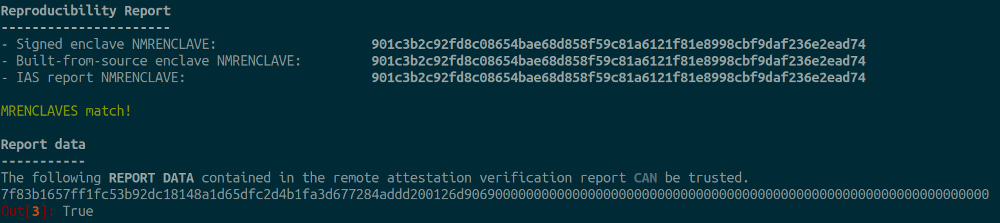

Examples
========
This section presents examples which can be followed through to see how the
``auditee`` tool can be used.

For background information see the section `<background-examples>`.

Prerequisites
-------------
To follow through the examples as they are presented it's best that you have
`<docker-compose>`_.

Clone the repository, for instance:

.. code-block:: shell

    $ git clone https://github.com/sbellem/auditee.git

.. _run-examples:

Running the examples
--------------------
This section presents examples which can be followed through to see how the
``auditee`` tool can be used. Each example contains the source code of an
enclave application, which for the sake of demonstration could be seen as
being under audit. One could imagine that an auditing party would inspect the
source code of the enclave to verify that it meets a set of requirements with
respect to security, functionalities, etc. In addition to the source code,
each example contains a pre-built and signed enclave binary, usually named
``Enclave.signed.so``, and a remote attestation verification report from
Intel's attestation service (IAS). In these examples, the IAS report is in a
json file, usually named ``ias-report.json``, which also contains Intel's
signature and certificate necessary to verify the authenticity of the report.
To sum up, an example contains the following pieces of information:

* enclave source code
* pre-built signed enclave binary (``Enclave.signed.so``)
* remote attestation report verified by Intel (``ias-report.json``)

A remote attestation report can contain application and/or user specific data
in a field named ``REPORT_DATA``. This report data is added by the enclave
code at the time a quote is generated. Each example presented in this
documentation will attempt to show a different usage of this ``REPORT_DATA``
field.

.. One important thing to notice is that if a remote attestation report
.. is "trusted" and hence the ``REPORT_DATA`` it contains, users and applications
.. can rely this ``REPORT_DATA``.

sgx-hash
^^^^^^^^
In this example, the enclave code computes the hash (SHA 256) of the string
`"Hello World!"` and puts the result in the ``REPORT_DATA`` of an attestation
report that can be sent to Intel for verification. Roughly speaking,
``auditee`` can be used to build an enclave binary from some source code and
check that its ``MRENCLAVE`` matches the one in the report. If the
``MRENCLAVE`` of the built-from-source enclave matches the one of the report,
one can then trust that the ``REPORT_DATA`` was indeed generated according to
the source code.

.. todo:: hash machine

.. code-block:: python

    In [52]: def hashmachine(v=b'Hello World!', i=1000000):
    ...:     now = time()
    ...:     for _ in range(i):
    ...:         x = sha256(v).digest()
    ...:     then = time()
    ...:     return x, then - now
    ...: 
    ...: 

    In [53]: h = hashmachine
    
    In [54]: h()
    Out[54]: 
    (b'\x7f\x83\xb1e\x7f\xf1\xfcS\xb9-\xc1\x81H\xa1\xd6]\xfc-K\x1f\xa3\xd6w(J\xdd\xd2\x00\x12m\x90i',
     0.6743361949920654)
    
    In [55]: h(i=10000000)
    Out[55]: 
    (b'\x7f\x83\xb1e\x7f\xf1\xfcS\xb9-\xc1\x81H\xa1\xd6]\xfc-K\x1f\xa3\xd6w(J\xdd\xd2\x00\x12m\x90i',
     6.5437891483306885)
    
    In [56]: h(i=100000000)
    Out[56]: 
    (b'\x7f\x83\xb1e\x7f\xf1\xfcS\xb9-\xc1\x81H\xa1\xd6]\xfc-K\x1f\xa3\xd6w(J\xdd\xd2\x00\x12m\x90i',
     68.60618114471436)
    
    In [57]: h(i=1000000000)
    Out[57]: 
    (b'\x7f\x83\xb1e\x7f\xf1\xfcS\xb9-\xc1\x81H\xa1\xd6]\xfc-K\x1f\xa3\xd6w(J\xdd\xd2\x00\x12m\x90i',
     680.1195211410522)

From the root of the project, spin up a container:

.. code-block:: shell

    $ docker-compose run --rm auditee bash

Go into the directory of the ``sgx-hash`` example:

.. code-block:: console

    root@f07e2606a418:/usr/src# cd examples/sgx-hash/

Start an ipython session:

.. code-block:: console

    root@f07e2606a418:/usr/src/examples/sgx-hash# ipython

Now, for that sake of this example, imagine that someone ends you over some
data
We now want to verify that the ``REPORT_DATA``

Use the :py:func:`verify_mrenclave` to verify the ``MRENCLAVE`` that a given signed enclave
can be re-built from some source code, and that

.. code-block:: python

    import auditee

    auditee.verify_mrenclave(
        'sgx-quote-sample/',
        'Enclave.signed.so',
        ias_report='ias-report.json',
    )

.. _background-examples:

Background
----------
**How can one trust the output of an enclave?**

Assuming one trusts the physical security of a chip, that known attacks have
been mitigated, and that the enclave code is not vulnerable to side channel
attacks, then how can one be certain that the output of an enclave is
trustworthy? The short answer is:

    **audits** + **reproducible builds** + **remote attestation**

.. _audits:

Audits
^^^^^^
Audits are necessary to verify that the enclave code does indeed what it is
expected to do and that it meets specific security requirements. For instance,
it may be possible through a security audit to verify that the enclave was
implemented such that it is not vulnerable to certain side-channel attacks.
See https://arxiv.org/abs/2006.13598.

.. todo:: Provide references/citations.

It's essential to make sure that the source code being audited is the exact
code that was used to build the enclave (`Enclave.signed.so`) that is
deployed. Hence, a signed enclave binary must be reproducible from its source
code. The next section covers reproducible builds in the context of enclaves.

.. _reproducible-builds:

Reproducible builds
^^^^^^^^^^^^^^^^^^^
In the context of SGX enclaves, a reproducible build mainly
means that the MRENCLAVE remains constant.

.. _remote-attestation:

Remote attestation
^^^^^^^^^^^^^^^^^^
The remote attestation report also
contains the MRENCLAVE, and can therefore be checked against the source code,
and the pre-built enclave under audit. In other words, given a remote
attestation report, it's possible to verify that the report was generated
by an enclave binary, and it's possible to verify that the enclave binary
was built from a specific version of source code. Through this verification
process a user can then gain trust in the ``REPORT_DATA`` contained in the
remote attestation report. This ``REPORT_DATA`` can contain arbitrary data,
according to the needs of the application.

The auditee tool wishes to help a user of an application that relies on
some output of an enclave wishes

Current State & Motivation
--------------------------

Techincal Challenges
^^^^^^^^^^^^^^^^^^^^

.. _docker-compose: https://docs.docker.com/compose/install/
