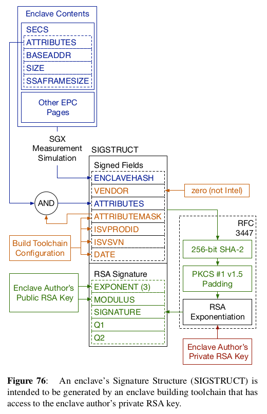

SGX Background
==============
Some brief notes and pointers about Intel SGX.

Measurement
-----------
The MRENCLAVE and MRSIGNER are known as measurements of an enclave. The
MRENCLAVE is also known as the enclave hash and can be used to verify that
an enclave contains the expected code and data. Enclave measurments are done
by SGX enabled processors but can also be simulated with a build toolchain,
and using the SgxSign tool from Intel's linux-sgx.

SIGSTRUCT
---------
From `Intel SGX Explained`_ by Victor Costan and Srinivas Devadas:

.. _intel sgx explained: https://eprint.iacr.org/2016/086
